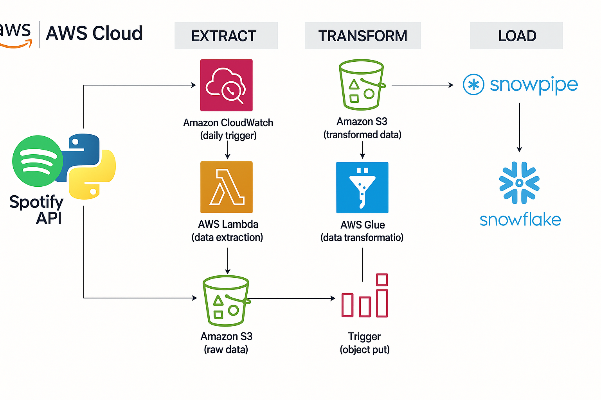

# 🎵 Spotify ETL Data Pipeline using AWS Glue (PySpark)

This project demonstrates a **scalable, fully automated ETL pipeline** that extracts music metadata from the Spotify API, stores it in Amazon S3, transforms it using AWS Glue (PySpark), and loads it into Snowflake via Snowpipe for analytics. The entire workflow is triggered automatically on a schedule with no manual intervention.

---

## 🗂️ Architecture Overview



---

## 🚀 Step-by-Step Pipeline Execution

### **Step 1: Extract Spotify API Data and Store in S3**
- AWS Lambda function (with Layer for dependencies) scheduled via EventBridge/CloudWatch to run weekly.
- Fetches songs, albums, and artist metadata from the Spotify Web API (via Spotipy).
- Stores raw JSON data in S3 under a structured folder hierarchy:

```bash
/spotify-etl-bucket/
├── raw/
│ ├── to-be-processed/
│ └── raw-processed/
├── transformed/
├── songs_data/
├── albums_data/
└── artists_data/
```

📸   
📸 

---

### **Step 2: Transform Data via AWS Glue (PySpark)**
- AWS Glue Job reads raw JSON files from `raw/to-be-processed/`.
- PySpark scripts flatten and clean complex JSON payloads into tabular datasets.
- Transformed data is stored in S3 `transformed/` folders in Parquet format.

📸   
📸 
📸 
📸 

---

### **Step 3: Archive Processed Files**
- After transformation, raw files are moved to `raw-processed/` as a backup to prevent reprocessing.
  
---

### **Step 4: Load into Snowflake via Snowpipe**
- Snowpipe continuously ingests transformed Parquet files from S3 into Snowflake tables.
- Separate tables for songs, albums, and artists enable efficient querying.

📸   
📸 
📸 
📸 

---

### **Step 5: Query & Analyze in Snowflake**
- SQL queries in Snowflake retrieve top songs, trending artists, and album statistics.

---

## ⚙️ Technologies Used

| Tool               | Purpose                                           |
|--------------------|---------------------------------------------------|
| **Spotify API**    | Data source for music metadata                    |
| **AWS Lambda**     | API data extraction & S3 landing                  |
| **Amazon S3**      | Raw & processed data storage                      |
| **AWS Glue (PySpark)** | Distributed data transformation               |
| **Snowflake + Snowpipe** | Data warehouse & continuous ingestion       |
| **EventBridge / CloudWatch** | Scheduled pipeline execution           |
| **Python + PySpark** | ETL logic & transformations                     |

---

